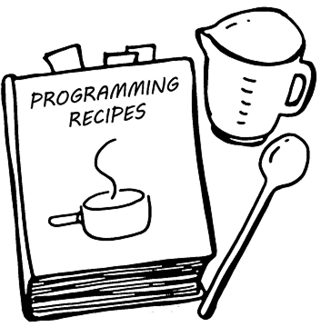

## Composing Code: My Experience Developing with Bowfolios
In the vast kitchen of software development, where recipes blend traditional techniques with modern flavors, Bowfolios serves as both a cookbook and a dining platform for the University of Hawaii community. My role in this culinary adventure was akin to that of a chef, meticulously selecting ingredients—in the form of design patterns—to create a satisfying dish that not only meets nutritional needs but also pleases the palate.


## Crafting a Balanced Meal: The MVC Pattern
Employing the Model-View-Controller (MVC) pattern was like organizing my kitchen into functional areas: preparation (model), cooking (controller), and presentation (view). This structure ensured that the storage of ingredients (data handling), the cooking process (logic execution), and the plating (user interface) were distinct yet harmoniously connected. Such organization allowed for efficient adjustments and ensured that any changes in the recipe (data) didn't affect the presentation (UI) directly.

```
const MockRecipePage = () => {
  const { recipeId } = useParams();
  const [selectedRecipe, setSelectedRecipe] = useState(null);
  const [loading, setLoading] = useState(true);
  const [error, setError] = useState(null);
```

## Selecting the Right Utensils: The Singleton Pattern
Utilizing the Singleton Pattern was crucial for managing resources, akin to using a single, well-maintained oven that guarantees consistent heat (database connections) throughout the preparation process. This ensured that all dishes (sessions and operations) could be cooked evenly without the chaos of multiple conflicting temperature settings.

## Adapting Recipes: The Strategy Pattern
The Strategy Pattern allowed for dynamic adjustments in the cooking process, similar to selecting different cooking techniques based on the ingredients and desired dish outcome. In Bowfolios, this meant adapting display strategies for user profiles and projects, allowing for customization based on user preferences without altering the core recipe.

## Garnishing the Dish: Observer and Decorator Patterns
The Observer Pattern acted as the kitchen's alert system, notifying all parts of changes—like a sous-chef announcing when an ingredient is added. This ensured that the user interface was always fresh and responsive.
Meanwhile, the Decorator Pattern was used to enhance elements without changing their basic structure, akin to adding garnishes or extra seasonings to enhance a dish without overhauling its fundamental flavors.


## Mastering the Kitchen: Template Method and Factory Patterns
Further sophistication in my coding cuisine came from implementing the Template Method and Factory Patterns. The Template Method pattern allowed me to define the skeleton of how a module or object would be executed, leaving the exact steps open to modifications—similar to a base recipe that can be varied according to taste. The Factory Pattern facilitated the creation of objects without specifying the exact class of object that would be created, enabling a more flexible instantiation akin to choosing kitchen tools based on what the recipe demands.

## Reflecting on the Culinary Journey
Developing with Bowfolios was a deep dive into the art of combining foundational coding practices with innovative design patterns, akin to blending traditional and modern culinary techniques. This experience was not just about following recipes but also about understanding when and how to adapt them creatively and effectively for diverse tastes and dietary needs.
In conclusion, just as a master chef uses a blend of classic and avant-garde techniques to delight diners, so too did the application of design patterns in Bowfolios allow me to craft an engaging and efficient platform. Each coding decision was a thoughtful addition to the recipe, contributing to a richer, more robust software experience, proving that in the world of software development, the right patterns can indeed cook up a storm.
