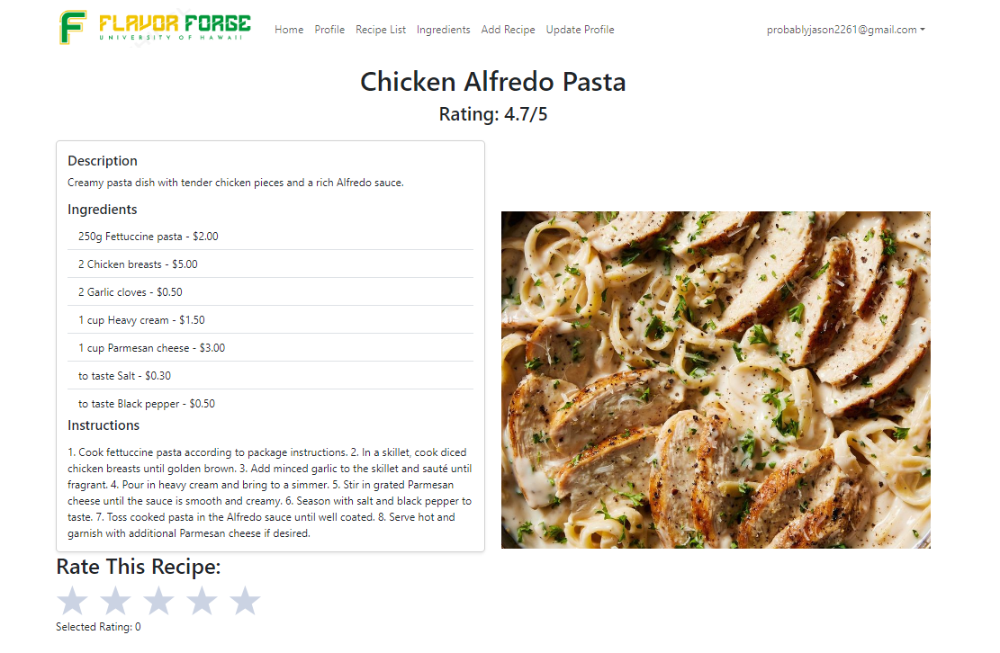

## Flavor Forge
Flavor Forge is a dynamic web platform designed for food enthusiasts to share, discover, and explore a wide variety of recipes. The website allows users to create personal profiles, upload their favorite recipes, browse through a diverse collection of culinary delights, and interact with other members of the community. The core mission of Flavor Forge is to foster a vibrant community where users can exchange cooking tips, celebrate food cultures, and inspire each other with their culinary creations

Overview of the project:

## Home Page

## Recipe

## RecipeList

## Profile

## My Role in the Project: Edit Recipe Page
For this project, I was responsible for developing the Edit Recipe Page, a crucial feature that allows users to update and manage their recipes. This involved creating a user-friendly interface where users could modify recipe details such as ingredients, instructions, and photos.

## What I Learned
Developing the Edit Recipe Page provided valuable learning experiences in several areas of web development. I gained proficiency in using React for building interactive user interfaces and learned to manage state effectively to ensure that changes in the form were reflected correctly across the application. Additionally, I improved my skills in CSS to make the page visually appealing and user-friendly. Encountering issues such as the webpage not refreshing properly despite the underlying functionality working as expected, I honed my debugging skills and learned to use browser developer tools more effectively. I also worked closely with my teammates to resolve complex issues, and their insights and support were invaluable in overcoming technical challenges.

## Challenges and Solutions
One persistent issue we faced was that the webpage wouldn’t refresh properly after editing a recipe, even though the changes were successfully saved in the database. After thorough investigation, we identified that the problem was due to state not updating correctly. We implemented a workaround using React’s useEffect hook to trigger a refresh when necessary. This solution, combined with effective state management, resolved the issue. The project’s complexity sometimes required collaborative problem-solving. My teammates provided invaluable support, especially during debugging sessions. Their different perspectives often led to innovative solutions that I might not have considered on my own.

## Conclusion
In conclusion, my journey with Flavor Forge has been enlightening and immensely rewarding. Through this experience, I’ve come to appreciate the significance of teamwork in achieving collective goals. Working collaboratively with my peers, I’ve realized that pooling our diverse skills and perspectives not only enhances the quality of 

To see the website [Flavor Forge](https://flavor-forge.github.io/)
